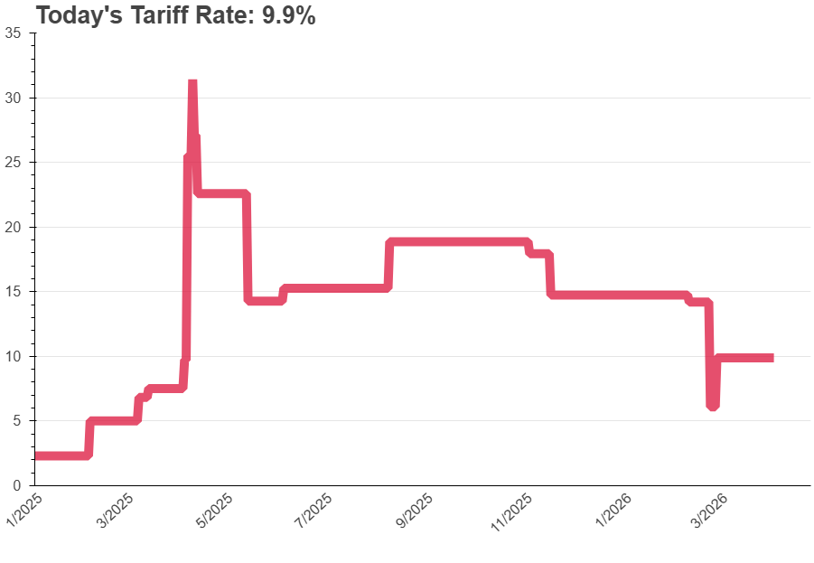

## Readme file for trade-war-redux-2025 

   

**Updated on 9/22/25**: This readme outlines calculations that go into tracking the US tariff actions. 

The ``.csv'' files discussed below will retain their naming conventions so they can be linked to directly for users purposes.

There are two noteboks behind the results. 

1. The file [make-tariff-by-country-by-time.ipynb](make-tariff-by-country-by-time.ipynb) builds a data set which constructs by time of announcement, by country, tariff rates. The underlying data file is [country-by-time.csv](country-by-time.csv) which is tariff rates, by time, by country for the top 50 trading partners of the U.S.  The file ["daily-tariff-latest-data.csv"](daily-tariff-latest-data.csv) is the daily, aggregate (trade weighted) average tariff rate.  

2. The file [plot-tariff-by-country-by-time.ipynb](plot-tariff-by-country-by-time.ipynb) constructs the graphics on the website. The first tab is the aggregate, daily tariff rate. This starts from the base applied tariff rate for 2024 and estimates how the U.S. tariff rate has changed over time. The second tab are current tariff rates across different countries. The third tab is the historical series. 

There is an additional notebook and data that may be of interest. The notebook [get-country-hs2-tariff.ipynb](get-country-hs2-tariff.ipynb) creates country by hs2 tariff rates for all 200+ countries in the world and creates country-specific files. The [data-hs2](./data-hs2) folder contains these files. 

The graphic plotting the long time series of applied tariffs uses the data set [federal-tax-duty.csv](federal-tax-duty.csv).

