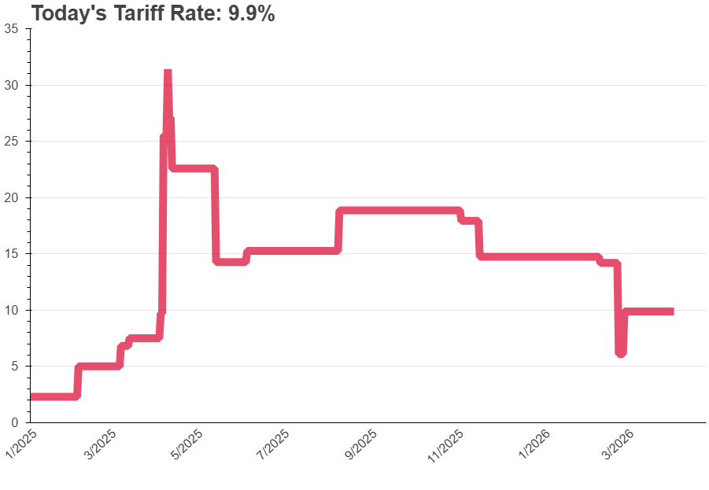

## trade-war-redux-2025

  

Updated: 2026-02-24

This repository tracks U.S. tariff changes and produces data + charts used in the public tracker.

## Primary workflow

1. [make-tariff-by-country-by-time.ipynb](make-tariff-by-country-by-time.ipynb)
   - Builds country/time tariff panel data.
   - Writes [country-by-time.csv](country-by-time.csv) and [daily-tariff-latest-data.csv](daily-tariff-latest-data.csv).

2. [plot-tariff-by-country-by-time.ipynb](plot-tariff-by-country-by-time.ipynb)
   - Reads the latest output files and produces website charts/tabs.
   - Uses [federal-tax-duty.csv](federal-tax-duty.csv) and [NIPA-imports.csv](NIPA-imports.csv) for historical tariff calculations.

3. [get-country-hs2-tariff.ipynb](get-country-hs2-tariff.ipynb)
   - Generates country-by-HS2 tariff outputs in [data-hs2](data-hs2).

## Key folders

- [data](data): source and helper data files.
- [data-hs2](data-hs2): generated HS2 tariff output files.
- [docs](docs): rendered HTML/chart outputs.
- [tariff-lists](tariff-lists): input tariff schedule/list files.
- [old-data](old-data): archived historical datasets not used by the main notebooks.
- [old-code](old-code): archived notebooks and code no longer part of the main workflow.
- [old-files](old-files): prior archive folder kept for backward compatibility.

## Tariff events tracked in `make-tariff-by-country-by-time.ipynb`

The notebook encodes U.S. tariff policy changes in a structured `TARIFF_ACTIONS` registry applied chronologically. Each action carries its effective date, legal authority, executive order/proclamation reference, and a short description. Actions are split into two phases: **Phase 1** resets country-level base rates (IEEPA layer); **Phase 2** stamps sector-specific tariffs and product exemptions on top.

### Phase 1 — Country-level base rates

| Date | Authority | Reference | Description |
|------|-----------|-----------|-------------|
| Feb 4, 2025 | IEEPA | EO 14193/14194/14195 | Fentanyl emergency: 20% on China and Hong Kong; Canada (EO 14193) and Mexico (EO 14194) also included but immediately paused |
| Mar 6, 2025 | IEEPA | Amendments to EO 14193/14194 | USMCA carve-out: Canada 8.75%, Mexico 4.5% |
| Apr 5, 2025 | IEEPA | EO 14257 | Reciprocal tariffs activate: 10% global baseline, country-specific rates from Annex I |
| Apr 8, 2025 | IEEPA | Amendment to EO 14257 | China/HK escalated to 84% reciprocal (+20% fentanyl = 104%) |
| Apr 9, 2025 | IEEPA | Amendment to EO 14257 | 90-day pause: all countries reset to 10%; China/HK raised to 125% |
| May 12, 2025 | IEEPA | U.S.-China Joint Statement (Geneva) | China/HK reciprocal from 125% to 10% (+20% fentanyl = 30%) |
| Aug 7, 2025 | IEEPA | EO 14326, EO 14323, EO 14325 | August country-specific rates from EO 14326; Brazil +40% (EO 14323); Canada fentanyl raised to 35% (EO 14325) |
| Nov 1, 2025 | IEEPA | EO 14358, EO 14357 | China 1-year truce: fentanyl reduced to 10% (net 20%); Canada rate scaled up |
| Nov 14, 2025 | IEEPA | U.S.-Switzerland Joint Statement | Switzerland rate capped at 15% |
| Dec 4, 2025 | IEEPA | ITA notice (90 FR 55964) | South Korea deal: 15% reciprocal ceiling |
| Feb 7, 2026 | IEEPA | EO suspending EO 14329; U.S.-India framework | India: Russian oil tariff removed, reciprocal reduced to 18% |
| Feb 20, 2026 | Executive Order | EO "Ending Certain Tariff Actions" | Supreme Court rules IEEPA does not authorize tariffs (*V.O.S. Selections v. United States*, 6-3); all IEEPA ad valorem duties revoked; Section 232 and 301 preserved; base rates zeroed |
| Feb 24, 2026 | Section 122 | Proclamation "Imposing a Temporary Import Surcharge" | 10% universal surcharge (150-day balance-of-payments emergency); Canada/Mexico USMCA-compliant goods exempt |

### Phase 2 — Sector overrides and product exemptions

| Date | Authority | Reference | Description |
|------|-----------|-----------|-------------|
| Mar 12, 2025 | Section 232 | Proclamation 10895 (aluminum), 10896 (steel) | Steel and aluminum tariffs at 25% globally |
| Apr 3, 2025 | Section 232 | Proclamation 10908 | 25% tariff on automobiles and parts; Canada/Mexico treated as ~15% |
| Apr 11, 2025 | IEEPA | Amendment to EO 14257 | Consumer electronics (phones, laptops, etc.) exempt from reciprocal tariffs |
| Apr 11, 2025 | IEEPA | EO 14257 Annex II | Annex II product-level exemptions from reciprocal tariffs |
| Jun 3, 2025 | Section 232 | Proclamation 10947 | Steel and aluminum tariffs raised to 50%; UK remains at 25% per bilateral deal |
| Aug 7, 2025 | Section 232 / IEEPA | Proclamation 10962, Proc 10908 amendments, EO 14323 Annex | Copper at 50%; auto deal rates for Japan, EU, South Korea at 15%; Brazil-specific product exemptions |
| Nov 14, 2025 | IEEPA | EO 14360 | Agricultural product exemptions; China phone fentanyl component reduced to 10% |
| Dec 4, 2025 | Section 232 | ITA notice (90 FR 55964) | South Korea auto deal at 15% |
| Feb 20, 2026 | Section 232 (surviving) | EO "Ending Certain Tariff Actions" — 232 preserved | Re-apply surviving 232 tariffs: steel/aluminum 50% (UK 25%), autos (25%, deal rates for UK/JP/EU/KR), copper 50% |
| Feb 24, 2026 | Section 122 | Proclamation Annex I, subdivision (aa)(ii) | Product exemptions from surcharge: energy (Ch. 27), critical minerals, pharma, ag, electronics, fertilizers, semiconductors, etc. (~1,098 HS codes) |

### Actions not yet incorporated

The following Section 232 actions require product-level HS code lists not yet available and are excluded from the current model:

| Date | Authority | Reference | Description |
|------|-----------|-----------|-------------|
| Oct 14, 2025 | Section 232 | Proclamation 10976 | Timber/lumber: 10% softwood, 25% furniture/cabinets |
| Nov 1, 2025 | Section 232 | Proclamation 10984 | Trucks/buses: 25% trucks and parts, 10% buses |
| Jan 15, 2026 | Section 232 | Proclamation 11002 | Semiconductors: 25% on narrow set of advanced chips |

---

## Cleanup notes (2026-02-24)

- Moved historical snapshots to [old-data](old-data):
  - [tariff-summary-05-22-2025.csv](old-data/tariff-summary-05-22-2025.csv)
  - [tariff-summary-06-03-2025.csv](old-data/tariff-summary-06-03-2025.csv)
- Moved legacy notebooks to [old-code](old-code):
  - [clean-aug7-list.ipynb](old-code/clean-aug7-list.ipynb)
  - [make-tariff-by-country-by-time-new.ipynb](old-code/make-tariff-by-country-by-time-new.ipynb)
  - [tariff-summary.ipynb](old-code/tariff-summary.ipynb)

