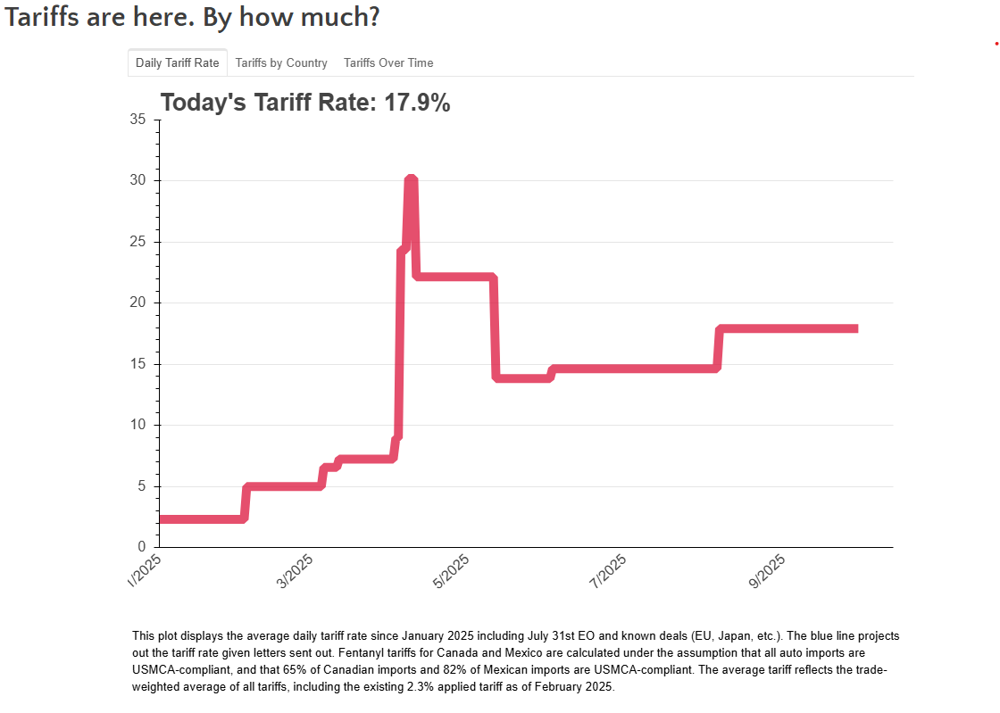

## trade-war-redux-2025

  

Updated: 2026-02-24

This repository tracks U.S. tariff changes and produces data + charts used in the public tracker.

## Primary workflow

1. [make-tariff-by-country-by-time.ipynb](make-tariff-by-country-by-time.ipynb)
   - Builds country/time tariff panel data.
   - Writes [country-by-time.csv](country-by-time.csv) and [daily-tariff-latest-data.csv](daily-tariff-latest-data.csv).

2. [plot-tariff-by-country-by-time.ipynb](plot-tariff-by-country-by-time.ipynb)
   - Reads the latest output files and produces website charts/tabs.
   - Uses [federal-tax-duty.csv](federal-tax-duty.csv) and [NIPA-imports.csv](NIPA-imports.csv) for historical tariff calculations.

3. [get-country-hs2-tariff.ipynb](get-country-hs2-tariff.ipynb)
   - Generates country-by-HS2 tariff outputs in [data-hs2](data-hs2).

## Key folders

- [data](data): source and helper data files.
- [data-hs2](data-hs2): generated HS2 tariff output files.
- [docs](docs): rendered HTML/chart outputs.
- [tariff-lists](tariff-lists): input tariff schedule/list files.
- [old-data](old-data): archived historical datasets not used by the main notebooks.
- [old-code](old-code): archived notebooks and code no longer part of the main workflow.
- [old-files](old-files): prior archive folder kept for backward compatibility.

## Cleanup notes (2026-02-24)

- Moved historical snapshots to [old-data](old-data):
  - [tariff-summary-05-22-2025.csv](old-data/tariff-summary-05-22-2025.csv)
  - [tariff-summary-06-03-2025.csv](old-data/tariff-summary-06-03-2025.csv)
- Moved legacy notebooks to [old-code](old-code):
  - [clean-aug7-list.ipynb](old-code/clean-aug7-list.ipynb)
  - [make-tariff-by-country-by-time-new.ipynb](old-code/make-tariff-by-country-by-time-new.ipynb)
  - [tariff-summary.ipynb](old-code/tariff-summary.ipynb)

